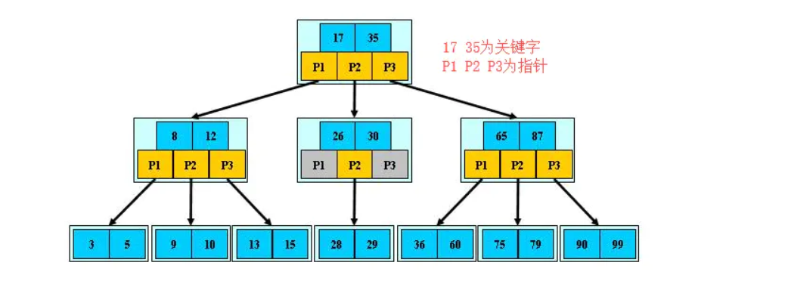
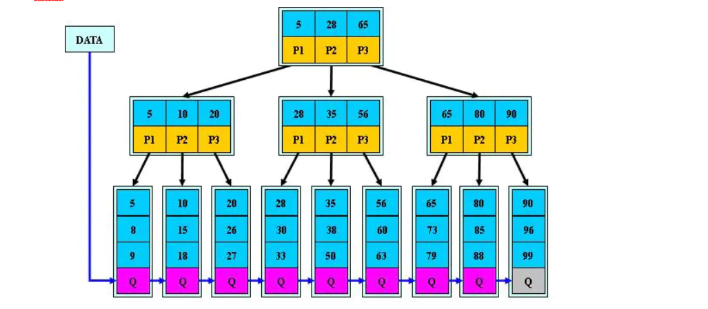
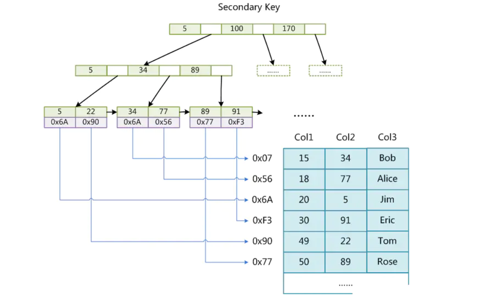
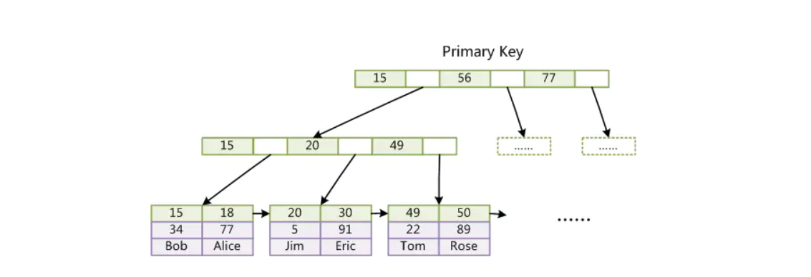
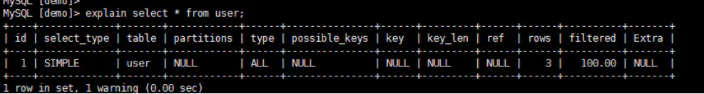
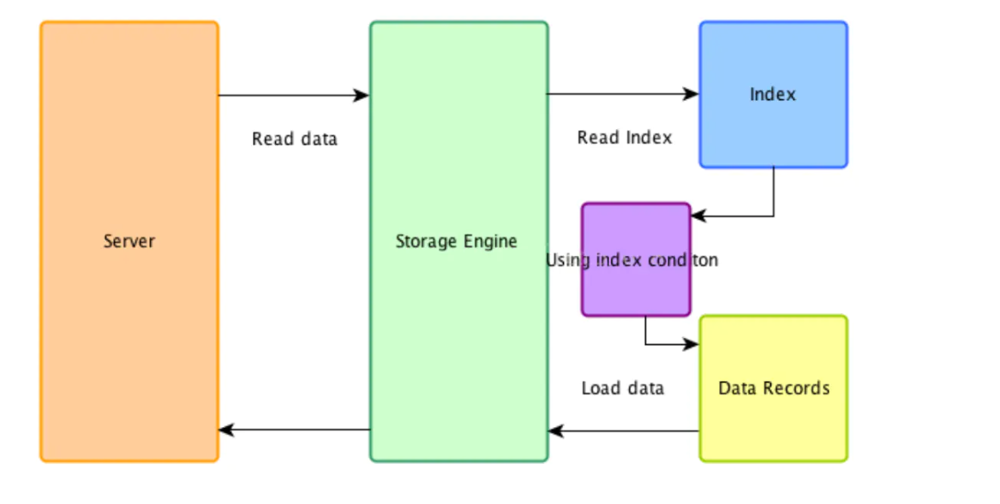

### mysql之索引

#### 索引是什么?

- 官方介绍索引是帮助MySQL高效获取数据的数据结构.打个比方来说的话相当于我们生活中字典.

#### 索引的优势和劣势

- 优势: 
  - 可以加快数据的检索速度,降低磁盘的IO,提高查询效率.
  - 索引列可以对数据进行排序,减低cpu的消耗
- 劣势: 
  - 索引是需要占用磁盘空间的.
  - 索引只是针对查询会提升性能.对增删改反而会降低.原因是因为要维护索引,会产生磁盘IO.

#### 索引的分类

- 单列索引 
  - 普通索引:mysql中的基本索引类型,只是为了查询快一些.
  - 主键索引:mysql主键列上添加索引.不允许有null和空值
  - 唯一索引:唯一列上添加索引,允许有null和空值
- 组合索引 
  - 在同一张表里多个列上添加索引
  - 需要遵循最左前缀原则
  - 建议使用组合索引替代单列索引,主键索引分情况.

#### 索引的使用

##### 索引的创建

首先说明我们有一张user表,字段分别为主键id,name,age.

- 单列普通索引

  ```
  create index idx_name on user(name(10));
  复制代码
  ```

  ​	这里想说明一下,我们在工作中对某个字段添加索引时,目标字段由于是varchar类型,可能比较长,为了更好的维护索引和减少索引占用磁盘空间的大小,我们可以在列后面加上索引的长度.

- 唯一索引

  ```
  create unique index idx_id on user(id);
  复制代码
  ```

  ​	主键索引是唯一索引的特殊类型,建议主键索引使用整数,整数占用空间比较小.同样可以为索引指定长度,如果是int类型就不需要指定了.

- 组合索引

  ```
  create index idx_id_name_age on user(id,name(10),age);
  复制代码
  ```

  - 最左前缀原则:

    - 说明一点我们创建了以上组合索引的时候,相当于创建了是三个索引: 
      - id,name,age
      - id,name
      - id

    ```
    select * from user where age = 13 and id =1 and name = 'VN';
    复制代码
    ```

    此时是否使用到了组合索引?

    这种情况下是违反了最左前缀原则,由于我们创建的索引的顺序是id,name,age.我们在使用组合索引的时候应该也要遵循这个顺序,如果打乱顺序那么就会导致索引失效.正确使用组合索引应该是以下sql语句:

    ```
    select * from user where id = 1 and name = 'VN' and age = 13;
    复制代码
    ```

    还有以下情况,是否使用到了索引.

    ```
    select * from user where id =1 and name = 'VN';
    复制代码
    ```

    ```
    select * from user where id =1;
    复制代码
    ```

    以上两条sql语句是正确使用了索引的,因为组合索引也可以拆开使用,但一定是有顺序的,不能打乱,从打乱索引顺序的时候开始,往后的索引就是失效了.

    ###### 切记:如果索引顺序是以上情况,直接拿name,或者age来用,索引是失效的.因为违背的最左前缀原则,即使把组合索引拆开来用,也一定是有序的.

#### 删除索引

```
drop index idx_id_name_age on user;
复制代码
```

#### 查看索引

```
show index from user \G;

复制代码
```

------

#### 索引的数据结构

在开始具体说索引的数据结构前,要说明一下,因为索引是mysql引擎中实现的,所以不同的存储引擎有不同的实现.由于现在mysql中InnoDB是默认的数据库引擎,并且我们大部分场景下使用的也是InnoDB引擎,所以在索引的数据结构这里,我们只针对于InnoDB引擎来说.

索引的数据结构是什么,相信我们大家都知道是B+tree,可具体什么是B+TREE呢?B+TREE长什么样子呢?B-TREE和B+TREE的区别是什么?这些问题大家就不一定都能回答上来了吧?

##### B-tree:(也叫做多路平衡树)





##### B+TREE:





以上两种是b-tree和B+tree的样子

###### b+tree在MyISAM的实现:





MyISAM非聚集索引.非叶子节点只存放着指向具体的数据的地址值.

###### b+tree在InnoDB的实现:





InnoDB聚集索引,非叶子节点存放有具体的数据.

###### b-tree和b+tree的区别

- b-tree叶子节点也是存放数据的,而b+tree只有非叶子节点存放数据,叶子节点存放的都是指向下一个节点的指针.
- b+tree非叶子节点使用链表结构相邻的两个非叶子节点相连.

#### 索引失效

在说索引失效之前,不得不先说一下explain查看执行计划.

##### 执行计划

MySQL 提供了一个 EXPLAIN 命令, 它可以对 SELECT 语句的执行计划进行分析, 并输出 SELECT 执行的 详细信息, 以供开发人员针对性优化. 使用explain这个命令来查看一个这些SQL语句的执行计划，查看该SQL语句有没有使用上了索引，有没 有做全表扫描，这都可以通过explain命令来查看。 可以通过explain命令深入了解MySQL的基于开销的优化器，还可以获得很多可能被优化器考虑到的访 问策略的细节，以及当运行SQL语句时哪种策略预计会被优化器采用。

用法如下:





其中各列的含义如下:

- id:select查询的标识符,每一个select有一个唯一的标识符.标识查询的执行顺序.

  - id相同,执行顺序从上往下
  - id不同,如果是子查询,id越大,优先级越高

- select_type:select查询的类型.

  - simple:简单的select查询
  - parmary:一个union或者子查询的操作,最外层的就是parmary
  - union:连接的两个都是查询,第一个是派生表dervied,往后的都是union
  - dependent union:出现在连接查询中,受外部查询影响
  - subquery:除了from中的子查询,其他地方的子查询
  - derived:from中出现的子查询,和之前提到的一样派生表

- table:查询的那张表.

  - 如果使用了别名,这里显示别名
  - 如果出现了尖括号,那说明是临时表
  - 如果不涉及表的操作,这里显示为null

- partitions:匹配的分区.

- type:连接类型

  ​		**性能从好到差排序**

  - system:只有一行数据或者是空表
  - const:使用唯一索引或者主键
  - eq_ref:出现在多表关联查询,对于前表的每一个结果抖只能匹配到一条结果
  - ref:非唯一索引,使用了组合索引符合最左前缀
  - fulltext:全文索引检索
  - ref_or_null:ref类似
  - unique_subquery:where中的in的子查询
  - index_subquery:子查询in形式子查询使用到了辅助索引
  - range:索引范围扫描
  - index_merge:使用了两个以上的索引
  - index:结果列中使用到了索引
  - index
  - ALL:全表扫描 
    - 只有all没有使用到索引,其他都使用到了索引
    - 建议使用到range级别

- possible_keys: 此次查询中可能选用的索引

- key: 此次查询中确切使用到的索引.

- ref: 哪个字段或常数与 key 一起被使用

- rows: 显示此查询一共扫描了多少行. 这个是一个估计值.

- filtered: 表示此查询条件所过滤的数据的百分比

- extra: 额外的信息

  - using index:索引覆盖,不需要回表扫描
  - using where:对storage engine提取的结果进行过滤,改字段没有索引
  - using filesort:排序中没有使用到索引
  - using temporary:使用了临时表存结果

#### 索引下推

大家都知道mysql架构分为了server层和引擎层.索引下推也叫做ICP.

##### 如何处理where条件

- index_key:确定索引中的连续范围,根据索引来确定范围

- index_filter:index_key确定了索引范围之后,还有一部分不符合条件,通过index_filter筛选

- table_filter:索引不能过滤的交给table_filter,也就是回表过滤

  **torage层**： 首先将index key条件满足的索引记录区间确定，然后在索引上使用index filter进行过滤 将满足的index filter条件的索引记录才去回表取出整行记录返回server层

  不满足index filter条件的索引记录丢弃，不回表、也不会返回server层

  **server 层**： 对返回的数据，使用table filter条件做最后的过滤。





使用ICP的好处:

- 直接去掉了不满足index_filter的记录,避免了回表和传到server层

#### 索引失效

- 违反了最左前缀原则会导致索引失效
- 索引上不要做计算,会导致索引失效
- 范围条件右边的列索引失效
- 索引字段不要使用不等,会导致索引失效
- 索引字段使用is null或者not null会导致索引失效
- 索引字段使用or会导致索引失效


