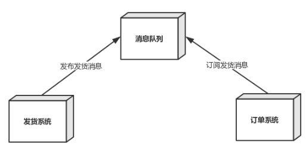

---
I walk very slowly, but I never walk backwards 
---

### 设计模式 - 设计模式伊始

------

​                                                                                                                                                                                **Survivor**

大家好~，我是Survivor，本教程我们来学习设计模式，其实设计模式，好多人称之为 " Java设计模式 "，但其实设

计模式并不是 Java 的专利，它不依赖语言，同样适用于 C++、C#、JavaScript 等其它面向对象的编程语言，这是

首先要和大家明确的一点，Java 是典型的面向对象的编程语言，所以本教程以 Java 为基础来讲解设计模式

#### 内容介绍

**凡事预则立，不预则废**，再开始学习一门新的课程之间，我们首先要来明确一下学习的内容及路线

首先，在正式的内容开始之前，我们首先要明确以下两点

- 为什么要学习设计模式，以及设计模式的重要性

- 设计模式的产生背景以及概念

  然后会依次给大家介绍**设计模式七大设计原则，认识UML类图以及类图六大关系，设计模式的分类以及二十三种**

**设计模式全面解析**，当然，不是蜻蜓点水哈，本教程中的每一个设计模式，我会给大家采用如下路线进行全面介绍

> **举例应用场景 ->  设计模式介绍 ->  分析实现步骤  ->  代码案例实操  -> 框架或项目中用到该模式的源码分析**

最后，希望大家通过本系列的学习，掌握多种设计模式的实现和本质，能够在工作中灵活运用解决实际问题，写出

优雅并且维护性可读性高的代码~，那我们开始启程吧~

#### 为什么要学设计模式

其实类似大家这样有一定工作经验的开发人员，了解以及进一步掌握设计模式是非常有必要的，因为平时大家接到

开发任务，首要目标是实现功能，而且现在的节奏~，时间紧，任务重，大家没有，可能也来不及做其他的考虑，

所以，大部分程序员写的代码，其实可维护性，可读性都很差，类之间的关系非常复杂，没有条理，那例如以后要

增加新的需求，现有的程序如何进行变动成本最低？如何保证新的功能模块不会对原来的项目产生影响？

##### 案例引入

举个栗子，大家看下如下两张图 

------

​              图一：茅草小屋                            

------

茅草小屋大家应该都看到过，一个简单的架构，盖几捆茅草，他不需要什么设计，也不需要花时间合理去架构，设

计他的初衷是为了遮风挡雨，大家可类比于单一的应用架构，个人开发，一个应用就能将所有的功能部署在一起，

打个war包扔到tomcat里即可运行，由于模型简单，代码层面也不需要考虑太多，重点在于功能的实现

------

​             图二：摩天大厦              

------

那大家来看图二的摩天大厦，一座这样的建筑，可以直接开工嘛？显示是不可以的，在项目开始之前，设计师需

要画设计图纸，考虑大厦的采光，通风，安全通道，承重...，做大量的准备工作

同样，大家可以类比于现在的分布式微服务项目，随着项目的复杂度直线上升，在项目开始之前，要进行需求宣

讲，架构设计评审...，这样的项目都是团队合作，除了要考虑服务之间的交互，服务内部代码的可读性，可靠性，

可维护性都是我们需要重点考虑的，这时候，设计模式就显得尤为重要

> **设计模式可以让你知道在某些场景下如何来设计出适合场景的架构，通俗点说，可以让你的代码更加“优雅”**

##### 设计模式的重要性

当然，设计模式，大家可以通俗理解为是前辈程序员在大量开发中累积的经验，掉了大量的头发，然后归纳为了这

些设计模式，当然，设计模式绝不是代表了**绝对**的开发真理，在问题面前应该灵活变通，当你的代码类结构合

理， 易于维护 ，可扩展性强，那么设计模式的目的就已经达到了，切记不要过渡的使用设计模式，**为了用而用**

------

当然，上面的说法还是针对于大牛而言的，对于咱们这种几年经验的码农，掌握设计模式就很有必要，当大家学习

并且使用到设计模式，如果你的项目做的非常大，之间关系非常复杂的时候，仍然能让你能掌控这些代码，不会

出现代码失控的情况，如同上面的案例，设计模式就是设计大厦的图纸

------

> **其次，很多成熟框架的源码里大量的用到了设计模式，如果掌握设计模式，对于阅读源码会有很大的帮助，**
>
> **如果你要学习源码，那么学习完设计模式再看的话，会更加清晰**

#### 设计模式的背景

设计模式最早出现在建筑领域，是克里斯托弗.亚历山大(Christopher Alexander，头衔很多的大佬) 对环境中不断

出现的问题， 总结出这些问题的解决方案。以后再遇到这些问题时，可以重用这些方案来解决

##### 四人帮（GOF）

1994年，有四位作者：**Erich Gamma**，**Richard Helm**，**Ralph Johnson**和**John Vlissides**发表了一本题为《设

计模式 - 可重用的面向对象软件元素》的图书，该书在软件开发中开创了设计模式的概念，第一次将设计模式提升

到理论高度，并将之规范化，这些作者被统称为四人帮（GOF），如下就是这四个大佬~

------

​                   四人帮                                   

------

#### 设计模式的概念

其实，关于设计模式的概念，上面已经作出解释，当然，我们来看下设计模式的官方概念

> **设计模式（design pattern）是对软件设计中普遍存在（反复出现）的各种问题，所提出的解决方案**

这个术语是由埃里希·伽玛（Erich Gamma）等人在 1990 年代从建筑设计领域引入到计算机科学的

#### 设计模式的原则

上面提到了，我们为什么要学习设计模式，在这里做一个简单的总结

> **设计模式是为了让软件（程序）具有更好的代码重用性，可读性，可扩展性，可靠性**

理论听着云里雾里，那到底是什么意思呢？举个栗子，何为具有更好的可靠性呢？

- 代码重用性：即相同功能的代码，不需要多次编写，可以重复使用
- 可读性：即编码的规范性，便于其他程序员阅读和理解
- 可扩展性：即当需要增加新功能时，成本低，也称为可维护性
- 可靠性：即代码强壮，当增加新的功能时，对原有的功能没有影响

**其实说到底，就是让程序呈现出高内聚，低耦合的特性**

##### 高内聚&低耦合

**耦合**主要描述模块之间的关系，**内聚**主要描述模块内部，当然模块的粒度可大可小（小到一个类 大-到一个系统）

- 高内聚  一个功能模块内部的元素，关联越强，则内聚越高，模块的单一性更强，一个模块应当尽可能独立完

  成某个功能

- 低耦合  功能模块和功能模块之间耦合性很低，A模块出现问题，避免影响B模块，比如模块A直接操作了模块B

  中数据, 则视为强耦合，例如下图，我们假设这样一个场景，发货系统发货，写入消息队列，订单系统这边订

  阅消息队列里的消息，如果订单系统出现故障，不影响发货系统正常写入消息队列，利用了消息中间件，两个
  
  系统之间的耦合性大大降低

------

​               解耦合示例                  

------

##### 设计模式原则引出

理解了高内聚&低耦合之后，我们正式进入到设计模式七大原则，那么，何为设计模式的原则呢？

> **其实是程序员在编程时，应当遵守的原则，也是各种设计模式的基础 (即：设计模式为什么 这样设计的依据)**

所以，我们先来认识一下设计模式常用的七大原则：

> **单一职责原则、接口隔离原则、依赖倒置原则、里氏替换原则、开闭原则、迪米特法则、合成复用原则**

这些原则并不是孤立存在的，它们相互依赖，相互补充，下面表格对于七大原则进行了一个简单的介绍

| 名称              | 设计原则简介                                                 | 重要性 |
| :---------------- | :----------------------------------------------------------- | ------ |
| **单一职责原则**  | 类的职责要单一，不能将太多的职责放在一个类中                 | ★★★★☆  |
| **开闭原则**      | 软件实体对扩展是开放的，但对修改是关闭的，即在不修改一个软件实体的基础上去扩展其功能 | ★★★★★  |
| **里氏代换原则 ** | 在软件系统中，一个可以接受基类对象的地方必然可以接受一个子类对象 | ★★★★☆  |
| **依赖倒置原则**  | 要针对抽象层编程，而不要针对具体类编程                       | ★★★★★  |
| **接口隔离原则**  | 使用多个专门的接口来取代一个统一的接口                       | ★★☆☆☆  |
| **合成复用原则**  | 在系统中应该尽量多使用组合和聚合关联关系，尽量少使用甚至不使用继承关系 | ★★★★☆  |
| **迪米特法则**    | 一个软件实体对其他实体的引用越少越好，或者说如果两个类不必彼此直接通信，那么这两个类就不应当发生直接的相互作用，而是通过引入一个第三者发生间接交互 | ★★★☆☆  |

设计原则和设计模式也是对系统进行合理重构的指南针，那么，何为合理重构？

> **合理重构，是在不改变软件现有功能的基础上，通过调整程序代码改善软件的质量、性能，使其程序的设计**
>
> **模式和架构更趋合理，提高软件的扩展性和维护性**

#### 下期预告

下一节，我们正式进入设计模式的学习，我会为大家用多个案例分析，来解读设计模式原则之单一职责原则，以及

它的注意事项和细节，从设计模式的原则开始，一步步走进设计模式的大门~，最后，希望大家在学习的过程中能

够感觉到设计模式的有趣之处，**高效而愉快的学习**，下期见~

​	
