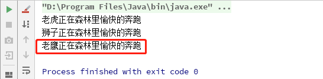

---
I walk very slowly, but I never walk backwards 
---


### 设计模式原则 - 单一职责原则

------

​                                                                                                                                                                                **寂然**


大家好~，我是寂然~，本节课呢，我来给大家介绍设计模式原则之单一职责原则，带领大家揭开设计模式原则

的神秘面纱，话不多说，我们进入正题。不知道大家是否遇到过下面这样的情况：

------

在实际开发的过程中，有时候大家会发现自己写的类越来越大，几百一千行，该类的功能也越来越多，有一些

开发者包括之前的我，看到自己写的类够大，功能够多，可能有点小自豪对吧，看，这是朕写下的江山！！但是当

某个功能需要做一个小改动时，就会发现整个程序出现了各种大大小小的问题，然后头发越来越少....

------

为什么只对这个类的一个功能做了小小的修改就会引起这么大的问题？其实就是因为我们违反了**单一职责原则，将**

**多种功能集成在一个类中，就等于把这些功能耦合了起来，一个功能的变化可能会削弱或者抑制这个类完成其他职**

**责的能力，而如果想要避免这种现象的发生，就要尽可能的遵守单一职责原则**，那什么是单一职责原则呢？

当然，我们还是首先来看一下单一职责原则的定义


#### 官方定义

> 单一职责原则（Single Responsibility Principle, SRP），有且仅有一个原因引起类的变更


#### 基本介绍

那根据上面给出的定义，我们来对单一职责原则进行一个基本介绍

即对类来说，一个类应该只负责一项职责。如类 A 负责两个不同职责：职责 1，职责 2，当职责 1 需求变更而

改变 A 时，可能造成职责 2 执行错误，所以需要将类 A 的粒度分解为 A1，A2

------

什么意思呢，给大家举个栗子，如果你项目中DAO层的一个类，既操作user表，又操作了order表，也就是说这个

javaBean既负责user表的增删改查，又负责order表的增删改查，那么这个类负责了两个不同的职责，就违反了单

一职责原则，所以根据原则需要将这个类的粒度分解为一个userDao操作user表，orderDao来操作order表


#### 案例：动物世界

大家听了单一职责原则的介绍，那我们来看如下一个案例

有一个动物类，里面定义一个在森林奔跑的方法，然后我们创建动物的实例，调用方法，方法内执行打印操作

```java
public class SingleDemo {
    public static void main(String[] args) {
        Animal animal = new Animal();
        animal.run("老虎");
        animal.run("狮子");
        animal.run("老鹰");
    }
}
//定义动物类
class Animal{
    //森林奔跑方法
    public void run(String animal){
        System.out.println(animal + "正在森林里愉快的奔跑");
    }
}
```

首先这段代码没有语法上的问题，但是执行的时候，大家就可以看到，出现了明显的逻辑错误，老鹰是没办法在森

林里奔跑的，换句话说，在run方法中，出现了即有森林里的动物，又有天空上的动物，违反了单一职责原则

------



------


#### 解决方案一：拆分类为更小粒度

我们可以按单一职责原则，将原来的类Animal，分成多个类，在当前业务逻辑下，每个类负责不同的职责，所以

根据上面的案例，我们将Animal类根据奔跑的位置进行拆分，分解成不同的类即可，代码示例如下

```java
public class SingleDemo {
    public static void main(String[] args) {
        ForestAnimal forestAnimal = new ForestAnimal();
        forestAnimal.run("老虎");
        forestAnimal.run("狮子");
        SkyAnimal skyAnimal = new SkyAnimal();
        skyAnimal.fly("老鹰");
    }
}
class ForestAnimal{
    //森林奔跑方法
    public void run(String animal){
        System.out.println(animal + "正在森林里愉快的奔跑");
    }
}
class SkyAnimal{
    //森林奔跑方法
    public void fly(String animal){
        System.out.println(animal + "正在天空上愉快的飞翔");
    }
}
```

OK，那这样首先确实遵循了单一职责原则，同时也保证了业务逻辑的正确，但是大家同时考虑，这样做的改动很

大，我们不仅要拆分类，同时还要大范围修改客户端（即main方法里的代码也要改动）

那我们还可以怎样做呢？


#### 解决方案二：原有类进行修改

那上面提到，使用方案一，不仅要拆分类，同时还要修改客户端里的代码，那可能有人想到了，那我直接在原有类

的基础上进行改动呢？下面我们来看代码示例

```java
public class SingleDemo {
    public static void main(String[] args) {
        Animal animal = new Animal();
        animal.runForest("老虎");
        animal.runForest("狮子");
        animal.runSky("老鹰");
    }
}
class Animal {
    //森林奔跑方法
    public void runForest(String animal) {
        System.out.println(animal + "正在森林里愉快的奔跑");
    }
    //天空飞翔方法
    public void runSky(String animal) {
        System.out.println(animal + "正在天空上愉快的飞翔");
    }
}
```

那下面我们针对方案二进行一下分析

- 这种修改方法没有对原来的类做大的修改，只是增加了方法
- 客户端改动范围很小的同时保证了业务逻辑的正确

那这时可能有人要问了，那这样的写法，同样将森林和天空的动物耦合在一个类里了啊？

这里大家要注意哈，确是如此，但是，方案二虽然没有在类这个级别上遵守单一职责原则，但是在方法级别上，仍

然遵守单一职责原则，即一个方法只负责一项职责


> 通过上面两种方案，大家可以看到，方案一，类级别遵守了单一职责原则，但是改动的代价很高，方案二方
>
> 法级别遵守了单一职责原则，改动幅度较小，综上所述，单一职责原则最核心的其实就是**各司其职**


#### 注意事项&细节

- 降低类的复杂度，一个类只负责一项职责

  （一个类的职责少了，相应的复杂度就会降低）

- 提高类的可读性以及可维护性

  （相应的复杂度降低，代码量就会减少，可读性也就会提高，可维护性自然就提高了）

- 降低变更引起的风险

  （一个类的职责越多，变更的可能性就更大，变更带来的风险也就越大）

- 通常情况下，我们应当遵守单一职责原则

  （只有逻辑足够简单，才可以在代码级违反单一职责原则，只有类中方法数量足够少，才可以在方法级别保持

   单一职责原则，参考方案二）


#### 如何遵守单一职责原则？

上面的注意事项中也提到了，身为设计模式七大原则之一，通常情况下，我们的代码应当遵守单一职责原则，那大

家肯定或多或少都有这样的疑问，如何遵守呢？

> 其实就是合理的职责分解，相同的职责放到一起，不同的职责分解到不同的接口和实现中去，这个是最容易
>
> 也是最难运用的原则，关键还是要从业务出发，从需求出发，识别出同一种类型的职责

需要说明的一点是：单一职责原则不只是面向对象编程思想所特有的，只要是模块化的程序设计，都适用单一职责


#### 下节预告

下一节，我们正式进入设计模式原则之接口隔离原则的学习，我会为大家用多个案例分析，来解读设计模式原则之

接口隔离原则，以及它的注意事项和细节，希望大家在学习的过程中，能够感觉到设计模式的有趣之处，**高效而愉**

**快的学习**，那我们下期见~