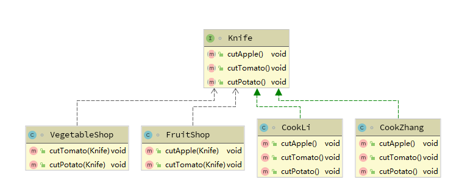
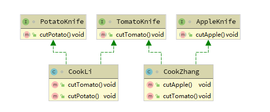

---
I walk very slowly, but I never walk backwards 

---


### 设计模式原则 - 接口隔离原则

------

​                                                                                                                                                                                **寂然**


大家好~，我是寂然~，本节课呢，我来给大家介绍设计模式原则之接口隔离原则，话不多说，我们直接进入正

题，老规矩，首先带大家了解一下接口隔离原则的官方定义，并作一个解释，然后我们通过案例代码来具体分析


#### 官方定义

接口隔离原则(Interface  Segregation Principle)，又称为ISP原则，官方定义为：

> 1. Clients should not be forced to depend upon interfaces that they don’t use. 
>    （客户端不应该依赖它不需要的接口）
> 2. The dependency of one class to another one should depend on the smallest possible interface. （类间的依赖关系应该建立在最小的接口上）


#### 基本介绍

其实通俗来理解就是，不要在一个接口里面放很多的方法，这样会显得这个类很臃肿不堪。接口应该尽量细化，一

个接口对应一个功能模块，同时接口里面的方法应该尽可能的少，使接口更加轻便灵活。


#### 案例演示 - 市场风云

为了让大家更好的理解接口隔离原则，我们通过一个案例来详细解析

假设有这样一个案例场景，现在有一个接口knife，给定他有三个能力，可以切苹果，切番茄，切土豆，两个类张

厨师，李厨师分别具有这些能力，有一个水果店类，假设是需要张师傅来切苹果和切番茄，而另一个蔬菜店类需要

李师傅来切番茄和切土豆

OK，明确了需求之后，那相关的基本定义代码如下图所示

```java
// 定义接口knife
interface Knife {
    //切苹果的能力
    void cutApple();

    //切番茄的能力
    void cutTomato();

    //切土豆的能力
    void cutPotato();

}

//张厨师类
class CookZhang implements Knife {

    @Override
    public void cutApple() {
        System.out.println("张厨师正在切苹果");
    }

    @Override
    public void cutTomato() {
        System.out.println("张厨师正在切番茄");
    }

    @Override
    public void cutPotato() {
        System.out.println("张厨师正在切土豆");
    }
}

//李厨师类
class CookLi implements Knife {

    @Override
    public void cutApple() {
        System.out.println("李厨师正在切苹果");
    }

    @Override
    public void cutTomato() {
        System.out.println("李厨师正在切番茄");
    }

    @Override
    public void cutPotato() {
        System.out.println("李厨师正在切土豆");
    }
}
```


上面这段代码相信大家并不陌生，将基本的定义好之后，那我们接着往下走，既然有一个水果店类，假设是需要张

师傅来切苹果和切番茄，蔬菜店类需要李师傅来切番茄和切土豆，那我们可以是这样一个思路，在水果店类里，定

义方法，将接口类型作为参数传入，调用方法则传入接口的实现类张厨师类，即水果店类通过接口来依赖或者说使

用张厨师类，从而达到上面的需求，OK，按照这个思路，相应代码如下图所示


```java
//水果店类
class FruitShop {
    // 将接口类型作为参数传入
    public void cutApple(Knife knife) {
        knife.cutApple(); 
    }

    public void cutTomato(Knife knife) {
        knife.cutTomato();
    }
}

//蔬菜店类
class VegetableShop {

    public void cutTomato(Knife knife) {
        knife.cutTomato();
    }

    public void cutPotato(Knife knife) {
        knife.cutPotato();
    }
}

//简易测试代码示例
public class SegregationDemo {
    public static void main(String[] args) {
        
        new FruitShop().cutApple(new Cookzhang());   
        //打印结果：张厨师正在切苹果
        
        new VegetableShop().cutPotato(new CookLi());    
        //打印结果：李厨师正在切土豆
    }
}
```


#### 案例分析

OK，我们用上面的代码实现了这个简易案例，那接下来，我们就来分析一下，为了便于大家理解，我把对应的

UML类图展示出来，如下图所示、**当然，有关UML类图详细的知识会在后面和大家一一见面，不要着急哈**

------



------

OK，那么大家来看上面的类图，现在需求里，类FruitShop通过接口Kinfe会依赖或者说使用CookZhang，但是

FruitShop里面却只会用到CookZhang其中的两个方法，同样，类VegetableShop也是如此，换句话说，厨师

CookZhang 业务上需要两种切割的能力，就要实现接口 Kinfe，但是Kinfe对于CookZhang来说不是最小接口，

那么类 CookZhang 就必须去实现他们不需要的方法，对吧，上面的案例中 CookZhang 虽然用不到，但是也实现

了切土豆的方法，同样对于CookLi而言，也是这样

------

那么这时，大家回顾一下上面提到的接口隔离原则的定义，**类间的依赖关系应该建立在最小的接口上**，显然，上

面的写法虽然可以实现需求，但是Kinfe对于CookZhang来说不是最小接口，违反了接口隔离原则


#### 解决方案

那到这里有小伙伴就会问了，既然上面的情况违反了接口隔离原则，那按照隔离原则，代码上应当怎样处理呢？

那既然接口隔离原则建议 **类间的依赖关系应该建立在最小的接口上**，那我们不妨将接口 Kinfe 拆分为独立的几个

接口（这里我们拆分成 3 个接口），类 FruitShop 和类 VegetableShop 分别与他们需要的接口建立依赖关系

按照这种思路，代码示例如下图所示：

```java
// 将Knife拆分为三个接口
interface AppleKnife {
    //切苹果的能力
    void cutApple();
}

interface TomatoKnife {
    //切番茄的能力
    void cutTomato();
}

interface PotatoKnife {
    //切土豆的能力
    void cutPotato();
}

//张厨师类
class CookZhang implements AppleKnife,TomatoKnife {

    @Override
    public void cutApple() {
        System.out.println("张厨师正在切苹果");
    }

    @Override
    public void cutTomato() {
        System.out.println("张厨师正在切番茄");
    }
}

//李厨师类
class CookLi implements PotatoKnife,TomatoKnife {

    @Override
    public void cutTomato() {
        System.out.println("李厨师正在切番茄");
    }

    @Override
    public void cutPotato() {
        System.out.println("李厨师正在切土豆");
    }
}
```

按照第二种方案，我们将接口 Kinfe拆分为三个接口，张厨师需要切苹果和切番茄两种能力，就实现AppleKnife，

TomatoKnife两个接口即可，同样，水果店的代码示例如下：

```java
//水果店类
class FruitShop {

    public void cutApple(AppleKnife knife) {
        knife.cutApple();
    }

    public void cutTomato(TomatoKnife knife) {
        knife.cutTomato();
    }
}

//蔬菜店类
class VegetableShop {

    public void cutTomato(TomatoKnife knife) {
        knife.cutTomato();
    }

    public void cutPotato(PotatoKnife knife) {
        knife.cutPotato();
    }

}
```


解决方案对应的UML类图，如下图所示：

------



------


#### 案例总结

OK，那我们的代码改造完成，现行的代码就符合了接口隔离原则，经过这个案例，其实说白了，**接口隔离原则就**

**是当我一个类通过接口依赖（使用）另一个类的时候，要保证依赖的该接口是最小的，接口里面有方法用不到的，**

**就进行隔离，而隔离的做法就是，就对原来接口进行拆分，拆分为最小粒度，来避免耦合** 

------

接口隔离原则相对来说是比较简单的，但是呢，要给大家点出来，其实很多小伙伴实际开发中，所写的代码或多或

少都符合设计原则而不自知，现在一条一条明确出来，后面在写代码的过程中小伙伴们就会有意的去遵守这些看似

简单却很重要的设计模式原则，从而降低耦合，去提高代码的质量


#### 与单一职责原则对比

或许看到接口隔离原则这样的定义很多人会觉得和单一职责原则很像，但是这两个原则还是有着很鲜明的区别，接

口隔离原则和单一职责原则的审视角度是不同的，**单一职责原则要求类和接口职责单一，注重的是职责，是业务逻**

**辑上的划分，而接口隔离原则要求方法要尽可能的少，是在接口设计上的考虑**。

------

例如一个接口的职责包含10个方法，这10个方法都放在一个接口中，并且提供给多个模块访问，各个模块按照规

定的权限来访问，并规定了“不使用的方法不能访问”，这样的设计是不符合接口隔离原则的，接口隔离原则要

求“尽量使用多个专门的接口”，这里专门的接口就是指提供给每个模块的都应该是单一接口(即每一个模块对应一个

接口)，而不是建立一个庞大臃肿的接口来容纳所有的客户端访问

> **当然，根据接口隔离原则拆分接口时，首先必须满足单一职责原则**


#### 下节预告

OK，下一节，我们正式进入设计模式原则之依赖倒转原则的学习，我会为大家用多个案例分析，来解读设计模式

原则之依赖倒转原则，以及它的注意事项和细节，最后，希望大家在学习的过程中，能够感觉到设计模式的有趣之

处，高效而愉快的学习，那我们下期见~

