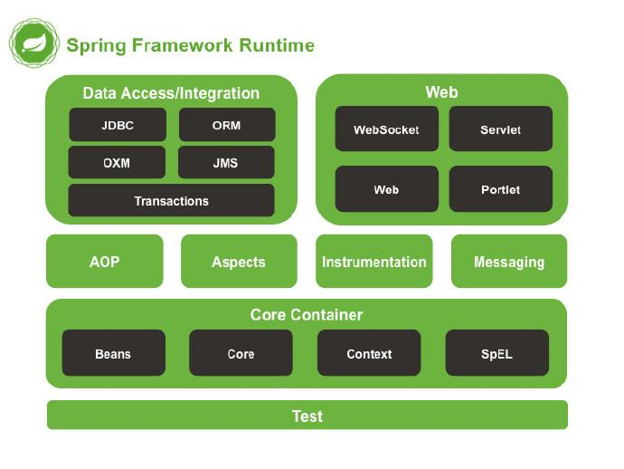
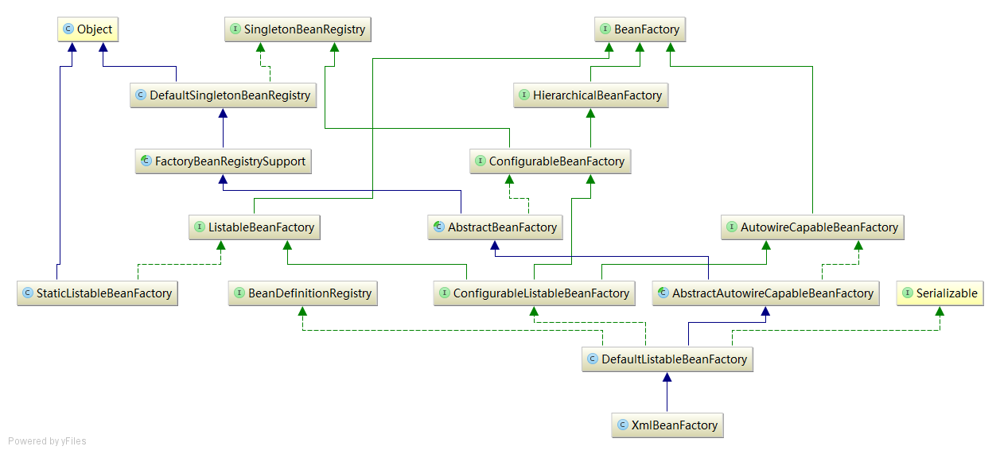
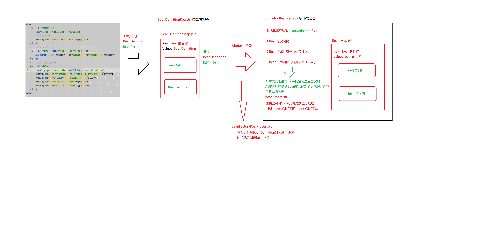
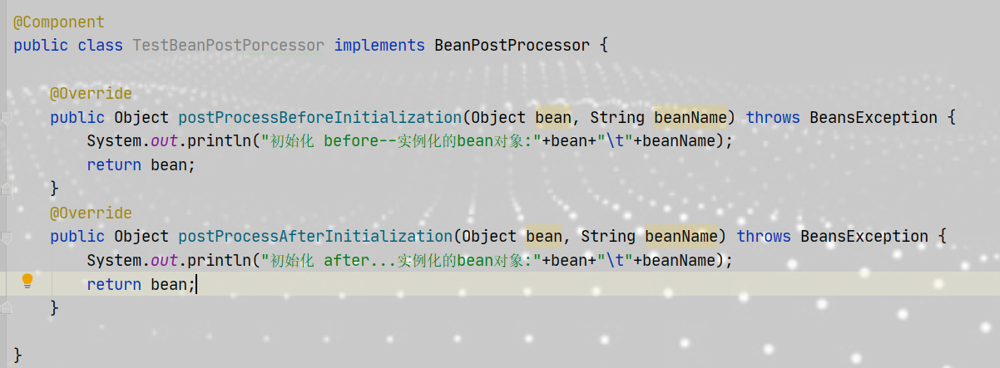
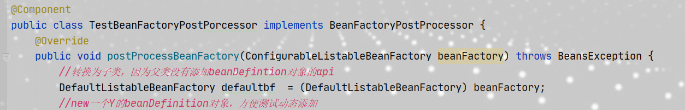

#### 学习spring框架必备知识点

​	spring作为java开源世界的第一框架，Spring已经成为事实上的Java EE开发标准，Spring框架最根本的使命是简化Java开发，提高工作效率，开发者基本上只需要关注业务实现。学习、研究、掌握Spring框架成为每一位Java开发人员的必备知识体系。而阅读源码则是学习Spring的最好方式之一，阅读源码可以很好的学习到作者的优秀代码，以及开发者设计的思想，回想一下让自己这样设计能有这样的想法？

##### 一，学习spring源码必要掌握的内功

###### 	架构的设计的七大设计原则

​	1.开闭原则

​			 在面向对象的开发过程中，一个类、模块应该面向扩展开放、面向修改关闭。强调用抽象来构建框架，用实现来扩展细节。

​	2.依赖倒置原则

​			 高层次模块不应该依赖低层次模块，高层次模块和低层次模块都应该依赖抽象；抽象不应该依赖细节，细节应该依赖抽象，进而减少模块之间的相互依赖（耦合），从而提高系统的稳定性和可维护性

​	3.单一职责原则

​			单一职责是指在类层面，方法层面，接口层面的职能都是单一的。在类中，职责一和职责二发生改变都会影响到同一个class类，那么都有可能造成当职责过多的时候，牵一发而动全身，系统耦合度太高而不便于维护!

​	4.接口隔离原则

​			用多个职能专一的接口，而不是使用将多种职能的方法都集中在一起的接口，一个类对一个类的依赖应该建立在最小的接口上。接口隔离原则理论上是对接口进行细化，但是过于细化的接口必然会导致代码过于复杂，因此在接口创建过程中即要防止接口声明过多，也要防止接口里面方法体太多从而导致某些类出现空实现!

​	5.迪米特原则

​			一个对象应该对其他对象保持最少的了解，一个对象只需要保持对其朋友对象的关注就好，其他的交给中介类。无论什么类，当一个类中加载过多类的引用或者对象声明，那么这个类将会与其被引用的类产生高度的耦合，非常不利于代码的维护和扩展。因此在一个类对另外一个类进行引用的时候，如非必要，尽可能不要引入其类。就比如少用继承多用聚合或者组合也是这个道理！

​	6.里式替换原则

​			程序中可以使用父类的地方，一定也可以使用子类，即子类可以替换掉父类而不影响程序的正常运行；里氏替换是对开闭原则的扩展，他主要是制定了当我们队父类进行扩展时候的一些原则，同时这些原则也约束了继承的泛滥! 

​	7.合成复用原则

​		指应该尽量使用聚合或组合的方式而不是利用继承的方式来达到代码复用的目的。这样设计可降低代码之间的耦合性，一个类的修改造成的影响也更小。

​		学习设计原则可以帮我们写出更优雅的代码结构，再实际开发中很少会遵循设计原则，主要是考虑的因素太多，不能刻意追求完美。

##### 二，Spring中的设计模式有那些

1.工厂模式：只对结果负责

​		定义一个创建产品对象的工厂接口，将产品对象的实际创建工作推迟到具体子工厂类当中。这满足创建型模式中所要求的“创建与使用相分离”的特点。工厂模式是对简单工厂模式的进一步抽象化，其好处是可以使系统在不修改原来代码的情况下引进新的产品，即满足开闭原则。

2.单例模式：保证自己是独一无二的

​		该类负责创建自己的对象，同时确保只有单个对象被创建。这个类提供了一种访问其唯一的对象的方式，可以直接访问，不需要实例化该类的对象。

3.原型模式：一生万物

​		用一个已经创建的实例作为原型，通过复制该原型对象来创建一个和原型相同或相似的新对象。在这里，原型实例指定了要创建的对象的种类。用这种方式创建对象非常高效，根本无须知道对象创建的细节。

4.代理模式：找人办事

​		由于某些原因需要给某对象提供一个代理以控制对该对象的访问。这时，访问对象不适合或者不能直接引用目标对象，代理对象作为访问对象和目标对象之间的中介。

5.委派模式：包产到户，只关注结果

​		委派模式的基本作用就是负责任务的调用和分配，跟代理对象很像，可以看作一种特殊情况下的静态的全权代理，但是代理模式注重过程，委派模式注重结果。

6.策略模式：过程不同，结果一样

​		该模式定义了一系列算法，并将每个算法封装起来，使它们可以相互替换，且算法的变化不会影响使用算法的客户。策略模式属于对象行为模式，它通过对算法进行封装，把使用算法的责任和算法的实现分割开来，并委派给不同的对象对这些算法进行管理。

7.模板模式：按规矩办事，可以有变通

​		定义一个操作中的算法骨架，而将算法的一些步骤延迟到子类中，使得子类可以不改变该算法结构的情况下重定义该算法的某些特定步骤。它是一种类行为型模式。

8.适配器模式：兼容

​		将一个类的接口转换成客户希望的另外一个接口，使得原本由于接口不兼容而不能一起工作的那些类能一起工作。适配器模式分为类结构型模式和对象结构型模式两种，前者类之间的耦合度比后者高，且要求程序员了解现有组件库中的相关组件的内部结构，所以应用相对较少些。

9.装饰者模式：包装

​		指在不改变现有对象结构的情况下，动态地给该对象增加一些职责（即增加其额外功能）的模式，它属于对象结构型模式。

10.观察者模式：你不动我不动，牵一发动全身。

​		指多个对象间存在一对多的依赖关系，当一个对象的状态发生改变时，所有依赖于它的对象都得到通知并被自动更新。这种模式有时又称作发布-订阅模式、模型-视图模式，它是对象行为型模式。

以上是spring框架中常用的设计模式，掌握这些设计模式可以很好的写出看着另人舒服的代码。

##### 三，Spring的设计初衷

​		为程序开发者提供一个一站式、轻量级的开发平台，这个平台不仅可以降低代码的开发难度、降低代码之间的耦合度还可以与第三方中间件更好、更便捷的结合。通过IOC容器来管理POJO对象；通过依赖注入和面向接口松耦合；通过AOP，以动态、非侵入的方式来增强服务的功能。IOC和AOP是Spring的核心部分，是最为底层的抽象。 而他主要是通过：面向 Bean(BOP)、依赖注入（DI）以及面向切面（AOP）这三种方式来达成的。

###### BOP

​		Spring 是面向 Bean 的编程（Bean Oriented Programming, BOP），Bean 在 Spring 中才是真正的 主角。Bean 在 Spring 中作用就像 Object 对 OOP 的意义一样，Spring 中没有 Bean 也就没有 Spring 存在的意义。Spring 提供了 IOC 容器通过配置文件或者注解的方式来管理对象之间的依赖关系。

###### 依赖注入

​	Spring 设计的核心 org.springframework.beans 包（架构核心是 org.springframework.core 包），它的设计目标是与 JavaBean 组件一起使用。这个包通常不是由用户直接使用，而是由服务器将 其用作其他多数功能的底层中介。基础 BeanFactory 接口，它是工厂设计模式的实现， 允许通过名称创建和检索对象。BeanFactory 也可以管理对象之间的关系。 BeanFactory 最底层支持两个对象模型。 1，单例：提供了具有特定名称的全局共享实例对象，可以在查询时对其进行检索。Singleton 是默 认的也是最常用的对象模型。 2，原型：确保每次检索都会创建单独的实例对象。在每个用户都需要自己的对象时，采用原型模式。 Bean 工厂的概念是 Spring 作为 IOC 容器的基础。IOC 则将处理事情的责任从应用程序代码转移到 框架。

###### 面向切面

​		Spring提供了面向切面编程的丰富支持，允许通过分离应用的业务逻辑与系统级服务进行内聚性的开发。应用对象只实现它们应该做的——完成业务逻辑——仅此而已。它们并不负责其它的系统级关注点，例如日志或事务支持。

##### Spring架构

Spring数据访问和集成模块：主要实现了包括Spring支持各种ORM框架，如JDBC Template、JPA、mybatis等的集成；还包括了Spring集成Marshalling XML的处理模块；以及对Spring包括声明式与编程式事务的支持。

Spring-Web模块：主要实现了Spring对Web的支持，如SpringMvc、Webservice等的支持。

AOP和设备支持：由spring-aop、spring-aspects和spring-instrument3个模块组成，

​	spring-aop是Spring的另一个核心模块，是AOP主要的实现模块。作为继OOP后，对程序员影响最大 的编程思想之一，AOP极大地开拓了人们对于编程的思路。在Spring中，他是以JVM的动态代理技术为 基础，然后设计出了一系列的AOP横切实现，比如前置通知、返回通知、异常通知等，同时，Pointcut 接口来匹配切入点，可以使用现有的切入点来设计横切面，也可以扩展相关方法根据需求进行切入。 

​		spring-aspects模块集成自AspectJ框架，主要是为SpringAOP提供多种AOP实现方法。 

​		spring-instrument模块是基于JAVASE中的"java.lang.instrument"进行设计的，应该算是AOP的 一个支援模块，主要作用是在JVM启用时，生成一个代理类，程序员通过代理类在运行时修改类的字 节，从而改变一个类的功能，实现AOP的功能。在分类里，我把他分在了AOP模块下，在Spring官方文 档里对这个地方也有点含糊不清，这里是纯个人观点。

Spring核心模块：主要组件是BeanFactory，创建JavaBean的工厂，使用控制反转（IOC） 模式将应用程序的配置和依赖性规范与实际的应用程序代码分开。

spring-messaging模块：spring-messaging是从Spring4开始新加入的一个模块，主要职责是为Spring框架集成一些基础的报 文传送应用。

##### Spring BeanFactory继承体系

在springbean容器当中 xmlbeanFactory继承自DefaultListableBeanFactory,而DefaultListableBeanFactory是整个bean加载的核心部分,是spring加载并注册bean的默认实现 XmlBeanFactory中使用了自定义的XmlBeanDefinationReader 实现了个性化的BeanDefinationReader的读取,类图中 DefaultListableBeanFactory 继承了AbstractAutowireCapableBeanFactory 并实现了ConfigurableListableBeanFactory 以及BeanDefinationRegistry接口
BeanFactory:定义获取bean及bean的各种属性
SingletonBeanRegistry:定义对单例的注册和获取
DefaultSingletonBeanRegistry (DSBR):对接口SingletonBeanRegistry各种方法的实现
HierarchicalBeanFactory (HBF) :继承BF,也就是在BF的基础上增加了对parentFactory的支持
FactoryBeanRegistrySupport:在DefaultSingletonBeanRegistry的基础上增加了对FactoryBean的特殊处理
ConfigurableBeanFactory:提供配置Factory的各种方法
ListableBeanFactory :根据各种条件获取bean 的配置清单
AbstractBeanFactory:综合FactoryBeanRegistrySupport和ConfigurableBeanFactory的功能
AutowireCapableBeanFactory:提供创建bean,自动注入，初始化以及应用bean的后置处理器
AbstractAutowireCapableBeanFactory 综合AbstractBeanFactory 并对接口AutowireCapableBeanFactory进行实现

BeanDefinationRegistry(BDR):定义了对BD的各种增删该查操作ConfigurableListableBeanFactory: BeanFactory(BF)配置清单,指定忽略类型以及接口等
DefaultListableBeanFactory:综合上述所有功能，主要是对bean注册后的处理

##### spring的基础容器和高级容器

###### **BeanFactory：**

是Spring里面最低层的接口，提供了最简单的容器的功能，BeanFactory负责配置、创建、管理Bean，提供获取bean，是否包含bean,是否单例与原型，获取bean类型，bean 别名的方法

###### **ApplicationContext：**

应用上下文，ApplicationContext接口是由BeanFactory接口派生出来的，同样也是Spring更高级的容器，ApplicationContext提供了更多的额外的功能，默认初始化所有的Singleton，支持国际化，资源访问，消息发送、响应机制，AOP。

#### Bean概述

spring IoC容器管理了多个根据配置元数据创建的bean在容器内部，这些Bean可以描述为`BeanDefinition`对象，它主要包含这些元数据:

- 全类名：通常为Bean的实际实现类
- Bean的行为配置元素，这种状态描述了bean在容器中的行为，如作用域、生命周期回调等等.
- 当前bean依赖bean的引用: 依赖项
- 新创建对象中的其他配置设置，如池对象bean的池大小限制等.

容器除了通过配置元数据管理bean之外， 还可以通过`ApplicationContext`的方法`getBeanFactory()`获取`BeanFactory`的实现`DefaultListableBeanFactory`来注册自己的bean

**Bean的实例化，构造，初始化流程**

#### Bean作用域

bean的作用域主要用来控制单个配置产生的bean实例的数量以及产生的bean实例的作用范围。

spring支持7中作用域，其中5种仅在web的`ApplicationContext`下起作用.

- singletion: 默认作用域，在每个Spring容器中只有一个定义的bean实例
- prototype: 一个bean定义有多个实例
- request: 一个定义的bean的实例的生命周期为一次http request。仅在web下生效
- session: 一个定义的bean的实例的生命周期为一次http session。仅在web下生效
- globalSession: 一个定义的bean的实例的生命周期为一次global http request。仅在Portlet下生效
- application: 一个定义的bean的实例的生命周期为`ServletContext`，仅在web下生效
- websocket: 一个定义的bean的实例的生命周期为`WebSocket`

#### 容器扩展点

#### 使用`BeanPostProcessor`自定义bean

如果想在容器完成bean的初始化、配置和实例化之前加入一些自己的逻辑，那么可以通过插入一些`BeanPostProcessor`接口实现类来达到目的。

可以有多个`BeanPostProcessor`的实例，并且可以通过实现`Ordered`接口设置其顺序.

当一个`BeanPostProcessor`实例被注册到容器中后，对于容器中创建的每个bean在其初始化之前之后都会进行回调.一些AOP的基础设施类也是通过实现为`BeanPostProcessor`来提供代理逻辑.

如果在bean的配置元数据的时候，bean本身实现了`BeanPostProcessor`，spring容器会自动将其注册到容器中以便后续调用。

使用回调接口或者结合注解自定义`BeanPostProcessor`是IoC容器通常的扩展方式. 例如Spring的`RequiredAnnotationBeanPostProcessor`就是`BeanPostProcessor`的实现，它的作用是确保Java Bean被注解标记的属性是一个可以依赖注入的值.

####  使用`BeanFactoryPostProcessor`自定义配置

`BeanFactoryPostProcessor`与`BeanPostProcessor`重要的不同之处是：`BeanFactoryPostProcessor`操作的是bean的配置元数据，Spring允许`BeanFactoryPostProcessor`在容器实例化bean之前读取并修改配置元数据.

`BeanFactoryPostProcessor`可以配置多个，也可以通过实现`Ordered`接口设置顺序, 但不能将`BeanFactoryPostProcessor`配置为延迟加载，否则不起作用.

在Spring容器中定义的`BeanFactoryPostProcessor`可以自动被ApplicationContext执行，Spring中包含了一些农民人的实现，如`PropertyOverrideConfigure`与`PropertyPlaceholderConfigure`

总结

本章节只是对spring的一个简单的介绍，看本章内容可以重点关注**BeanFactory继承体系**，了解vBeanFactory的继承体系对spring的源码理解会有很大的帮助。

下一章节重点介绍的是怎么看源码，再源码里面进行断点测试，第一次怎么去看源码，应该从那里看。

