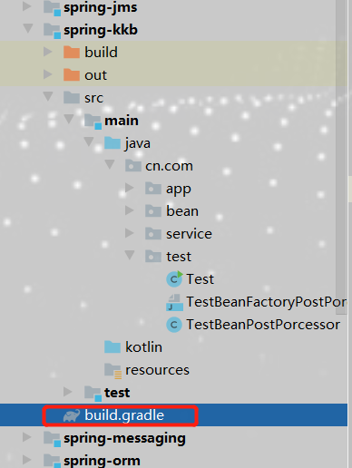

### 正式了解spring源码

​																												醉寒

#### 一、部署源码

##### 下再安装gradle

​	再windows环境下部署spring源码配置 gradle环境

​	下载地址 https://gradle.org/releases/  版本 4.9

​	idea 建议版本选择 2019.2以后的

##### 配置环境变量

##### 		配置环境变量

​		

##### 修改Gradle本地仓库路径

首先再你想放的位置建一个文件 文件名为 “.gradle”

##### 再环境变量配置本地路径

变量名一定要这样设置 GRADLE_USER_HOME 值就是你路径位置

到此，gradle环境安装完成

##### 源码下载

spring源码地址仓库  https://github.com/spring-projects/spring-framework

##### idea配置gradle

打开 file--->setings--->Build Execution... --->Build Tools 找到gradle

##### 导入源码

1、File ---> Module from Existing Sources...不要选错了

2、选中单击，点进去，找带源码位置

3、单击选中，点击Ok，会进入这个页面，点击右下角 Finish，就完成了导入

4、导入成功后是这种的

##### 编译源码

再右测找到gradle 打开会出现这种情况，点击这个圆圈，就会进行编译

编译成功

#### 二、再源码里创建模板测试

1.选中项目，右键，new mode

2、下一步

3、一直下一步，完成 

4、导入后的模块，是正常层级目录，区别就是，没有pom文件，是build.gradle

##### 测试代码

5、模块导入的很重要的事就是打开 build.gradle，再里面添加配置

6、给你们的项目里面都是建好的模块，直接运行就ok，到此，导入，编译，新建模块，测试都已经完 成

##### 测试结果

#### 三、spring核心容器

##### BeanFactory

Spring中的Bean的创建是典型的工厂模式，为开发者管理对象之间的依赖关系提拱了很多基础服务

BeanFactory作为顶层接口的一个接口类，定义了IOC容器的基本规范，BeanFactory有三个重要的子类，ListableBeanFactory,HierarchicalBeanFactory 和，AutowireCapableBeanFactory,但是从上图我们可以发现最终默认的实现类是DefaultListableBeanFactory,它实现了所有接口，再这里使用了接口隔离原则，每个接口都有它的使用场合，这里主要是为了区别Spring内部操作过程中对象的传递和转化，对对象的数据访问所做的限制。例如，ListableBeanFactory接口表示这些Bean可列表化，而HierarchicaBeanFactory，表示这些Bean是有继承关系的，也就是每个Bena可能有父Bean，AutowireCapableBeanFactory接口定义Bean的自动装配规则，这三个接口共同定义了Bean的集合，Bean之间的关系及Bean的行为。我们来看一下BenaFactory的源码

BeanFactory是一个顶级接口，再BeanFactory里只对IOC的容器基本行为做了定义，根本不关心你的Bean是如何定义的和怎么加载的。比如我们需要买一个物品，只需要知道从那里买就可以，而不需要知道工厂是怎么生产这些产品的。

Spring提供了许多IOC容器实现，比如，GenericApplicationContext、ClasspathXmlApplicationContext等

#### 三、找清主线源码入口

对于第一次看spring源码的人，都会感觉不知道到从那里看起，该怎么看，主要是spring由多个子项目组成，

如spring-beans，spring-context，spring-core，spring-aop，spring-web，spring-webmvc...其实不然，我们要寻找源码入口，这里我们是基于Xml的IOC方式进行的

再我们平常写测试方法获取Bean的时候，我们通常会使用 ClassPathXmlApplicationContext 我们本次也是从 ClassPathXmlApplicationContext开始的，先看一个测试方法

通过以上代码，一个基础的IOC容器就被创建起来了，接下来则是通过调用getBean的方法来完成bean的初始化工作

我们先看构造函数的作用 跟进 ClassPathXmlApplicationContext 

实际调用的构造函数是

还有AnnotationConfigApplicationContext

还有 FileSystemXmlApplicationContext、XmlWebApplicationContext等，都继承AbstractApplicationContext，主要用到了装饰者模式和策略模式，最终都是调用到了refresh()方法，也是核心方法

##### 开始启动

SpringIOC容器对Bean配置资源的载入是从Refresh()方法开始的，refresh()方法是一个模板方法，规定了IOC容器的启动流程，有些逻辑要交给其子类实现，它对Bean配置资源进行载入，ClassPathXmlApplicationContext通过调用其父类AbstractApplicationContext的refresh()方法，启动整个IOC容器对Bean定义的载入过程。

refresh() 方法主要为IOC容器Bean的生命周期提供管理条件，SpringIOC容器载入Bena配置信息从其子类容器的refreshBeanFactory方法启动，所以整个refresh() 方法中

ConfigurableListableBeanFactory beanFactory = obtainFreshBeanFactory(); 以后的代码都是再注册容器的信息和生命周期事件。

refresh()方法的主要作用就是，再创建IOC容器前，如果已经有容器存在，需要把自己已有的容器销毁和关闭，以保证再refresh()方法之后使用的是新创建的IOC容器，它类似于对IOC容器的重启，再新创建的容器中对容器进行初始化，对Bean配置资源进行载入

#### 总结

本章内容主要是，怎么导入源码和再源码里面添加测试方法，最主要是的 refresh方法里面的内容

下一章我 们将讨论如何创建容器。

